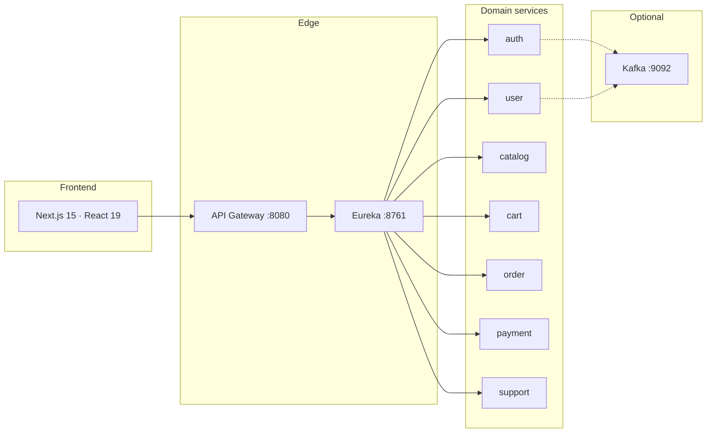

<div align="center">

# Nimbus Commerce

**A distributed e-commerce platform** — Next.js storefront, Spring Cloud gateway, independently deployable domain services.

[Architecture](#architecture) · [Services](#backend-services) · [Quick start](#quick-start) · [Local stack](#run-the-stack) · [Contributing](#contributing)

<br />


</div>

---

## Why Nimbus

Nimbus is built as **bounded-context microservices**, not a single monolith. The browser talks only to the API Gateway. Each domain owns its APIs, data, and (when needed) events.

```
Browser  →  Next.js  →  Axios  →  API Gateway :8080  →  Eureka :8761  →  owning service  →  Postgres
```

Auth is the most complete vertical today (JWT access tokens, refresh cookies, gateway routing). Other domains range from working slices to service shells. Some storefront pages still use fixture data in `frontend/src/data.ts`. Treat a gateway route as a **contract**, not a guarantee that the domain is fully implemented.

---

## Architecture



| Layer      | Role                                                                                  |
| ---------- | ------------------------------------------------------------------------------------- |
| Storefront | App Router, Tailwind CSS 4, TanStack Query / Form, Zod, Axios, Redux Toolkit for auth |
| Gateway    | Spring Cloud Gateway — path-based routing, JWT awareness                              |
| Discovery  | Netflix Eureka                                                                        |
| Domain     | Spring Boot 4, Java 21, Maven wrapper per module (no aggregator POM)                  |
| Data       | PostgreSQL **per owning service** (`*-dev.yaml` is gitignored)                        |
| Events     | Kafka only where a real workflow exists — local broker via Docker Compose             |

---

## Backend services

| Module                    | Port (committed) | Owns                                                  |
| ------------------------- | ---------------- | ----------------------------------------------------- |
| `backend/eureka-server`   | `8761`           | Service registry                                      |
| `backend/api-gateway`     | `8080`           | Frontend entry; load-balanced routes                  |
| `backend/auth-service`    | local profile    | Credentials, JWT access tokens, refresh-token cookies |
| `backend/user-service`    | local profile    | Profiles, addresses, admin customers                  |
| `backend/catalog-service` | local profile    | Products and categories                               |
| `backend/cart-service`    | local profile    | Carts and wishlists                                   |
| `backend/order-service`   | local profile    | Orders, admin orders / dashboard                      |
| `backend/payment-service` | local profile    | Payments                                              |
| `backend/support-service` | local profile    | Support                                               |

Domain ports live in gitignored `*-dev.yaml` profiles. Do not commit datasource URLs, JWT secrets, or passwords.

### Gateway prefixes

| Prefix                                                                         | Target          |
| ------------------------------------------------------------------------------ | --------------- |
| `/auth/**`                                                                     | auth-service    |
| `/users/**`, `/addresses/**`, `/admin/customers/**`                            | user-service    |
| `/products/**`, `/categories/**`, `/admin/products/**`, `/admin/categories/**` | catalog-service |
| `/cart/**`, `/wishlist/**`                                                     | cart-service    |
| `/orders/**`, `/admin/orders/**`, `/admin/dashboard/**`                        | order-service   |
| `/payments/**`                                                                 | payment-service |
| `/support/**`                                                                  | support-service |

---

## Frontend surfaces

| Area       | Routes                                                                                            |
| ---------- | ------------------------------------------------------------------------------------------------- |
| Storefront | Home, products, product detail, cart, checkout, payment, order confirmation, track order, support |
| Auth       | Login, register, forgot password, reset password                                                  |
| Account    | Profile, addresses, orders, wishlist, payment methods                                             |
| Admin      | Dashboard, products, customers, orders                                                            |

Stack: **Next.js 15** (App Router + Turbopack), **React 19**, **Tailwind CSS 4**, **TanStack Query**, **TanStack Form**, **Zod**, **Axios**, **Redux Toolkit**.

The client must call the **gateway**, not internal service ports.

```env
NEXT_PUBLIC_API_URL=http://localhost:8080
```

---

## Quick start

### Prerequisites

- **Node.js 22** and npm
- **JDK 21** (Temurin recommended)
- **Docker** for the local PostgreSQL and Kafka stack

### Storefront

```bash
cd frontend
npm ci
# set NEXT_PUBLIC_API_URL to the gateway, e.g. http://localhost:8080
npm run dev
```

Open [http://localhost:3000](http://localhost:3000).

```bash
npm run lint
npm run build
```

### A backend module

Each service is independent. Use that folder’s Maven wrapper.

```bash
cd backend/eureka-server
./mvnw -B -DskipTests package   # Unix
.\mvnw.cmd -B -DskipTests package  # Windows
```

Typical local order:

1. Start Eureka (`8761`)
2. Start domain services you need (after their Postgres / Kafka profiles exist)
3. Start the API Gateway (`8080`)
4. Start the Next.js app

`SpringBootTest` context tests expect local Postgres/Kafka and those gitignored profiles. CI compiles with tests skipped — a green compile is not a full integration test.

---

## Run the stack

### Local infrastructure

The compose stack provides one PostgreSQL service with a separate database per domain service, Kafka, and Kafka UI.
PostgreSQL is exposed on port **5432**, Kafka on **9092**, and Kafka UI on **8090**.
Do not assume these services are running in CI.

```bash
cd backend
docker compose up -d
```

Kafka UI: [http://localhost:8090](http://localhost:8090)

Events are **opt-in**. Producer, consumer, payload, and failure handling should exist together. Payloads must not include secrets, password hashes, or refresh tokens. If a `KAFKA_*.md` contract file is present at the repo root, keep code aligned with it.

### Configuration

| Do                                               | Don’t                                                  |
| ------------------------------------------------ | ------------------------------------------------------ |
| Use environment variables and local `*-dev.yaml` | Commit credentials, JWT secrets, or connection strings |
| Point the frontend at `localhost:8080`           | Point Axios at internal service ports                  |
| Keep one database per owning service             | Share tables across services                           |

---

## Repository layout

```text
Nimbus-Commerce-App/
├── frontend/                 # Next.js storefront + admin
├── backend/
│   ├── eureka-server/
│   ├── api-gateway/
│   ├── auth-service/
│   ├── user-service/
│   ├── catalog-service/
│   ├── cart-service/
│   ├── order-service/
│   ├── payment-service/
│   ├── support-service/
│   └── docker-compose.yaml   # PostgreSQL databases + Kafka + Kafka UI
└── .github/                  # CI, Copilot instructions, PR templates
```

---

## CI

| Workflow                                   | What it does                                                  |
| ------------------------------------------ | ------------------------------------------------------------- |
| [Frontend](.github/workflows/frontend.yml) | `npm ci` → lint → production build (Node 22)                  |
| [Backend](.github/workflows/backend.yml)   | Matrix compile of every Maven module, `-DskipTests` (Java 21) |
| CodeQL                                     | Static analysis on the default branches                       |

---

## Design principles

1. **Inspect first** — follow conventions already in the module you change.
2. **Ownership is explicit** — one service owns a capability and its tables.
3. **Contracts are shared** — frontend, gateway, and service change together.
4. **Smallest complete slice** — controller → validation → service → persistence → tests.
5. **No invented infrastructure** — no extra APIs, events, or dependencies without a demonstrated need.

---

## Known limitations

This repo mixes production-shaped features with work in progress:

- Some backend modules are still shells behind gateway routes
- Storefront can fall back to fixture catalogs
- Password recovery UI/API may be incomplete
- Role enforcement is not consistent everywhere
- Kafka config can exist without a full event flow
- Database ownership and migrations are not uniform yet

---

## Contributing

Issue and PR templates live under `.github/`. Path-specific guidance:

- [`.github/copilot-instructions.md`](.github/copilot-instructions.md) — repository overview
- [`.github/instructions/backend.instructions.md`](.github/instructions/backend.instructions.md)
- [`.github/instructions/frontend.instructions.md`](.github/instructions/frontend.instructions.md)
- [`.github/instructions/api-contracts.instructions.md`](.github/instructions/api-contracts.instructions.md)
- [`.github/instructions/events.instructions.md`](.github/instructions/events.instructions.md)
- [`.github/instructions/security.instructions.md`](.github/instructions/security.instructions.md)

Keep diffs focused. Do not weaken service boundaries to make a local change easier.

---

<div align="center">

Built for learning a real **gateway + discovery + domain services** e-commerce topology.

</div>
